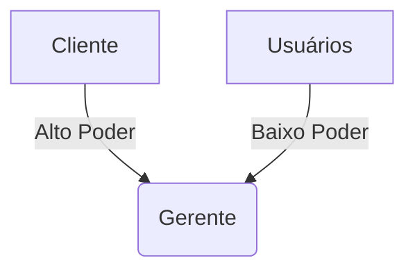

# 📊 **Gerenciamentos Essenciais em Projetos de TI**

## 1. 📅 **Gerenciamento de Tempo**
**O que é**: Controle de prazos e cronograma  
**Ferramentas**:  
- Gráfico de Gantt (MS Project, ClickUp)  
- Método PERT (para estimativas)  
**Exemplo**:  
> "No app de delivery, a tela de pagamento tem deadline de 15/08 - usamos sprints de 2 semanas para garantir"

---

## 2. 💰 **Gerenciamento de Custos**
**O que é**: Controle orçamentário  
**Técnicas**:  
- EVM (Earned Value Management)  
- ROI calculado  
**Dica**:  
> "Sempre reserve 10-15% para contingências"

---

## 3. ⚠️ **Gerenciamento de Riscos**
**Processo**:  
1. Identificação  
2. Análise (Probabilidade x Impacto)  
3. Plano de resposta  
**Matriz exemplo**:  
| Risco               | Prob. | Impacto | Ação                |  
|---------------------|-------|---------|---------------------|  
| Atraso na API Pagamento | Alta  | Crítico | Contratar fornecedor alternativo |

---

## 4. 📝 **Gerenciamento de Requisitos**
**Técnicas**:  
- User Stories  
- MoSCoW (Must, Should, Could, Won't)  
**Armadilha**:  
> "Requisitos ambíguos causam 56% dos retrabalhos (IBM)"

---

## 5. 👥 **Gerenciamento de Stakeholders**
**Mapa de Poder**:  

---

## 6. 🛠️ **Gerenciamento da Qualidade**
**Métricas**:  
- Defect Density (bugs/kloc)  
- Test Coverage  
**Framework**: PDCA (Plan-Do-Check-Act)

---

## 7. 🔄 **Gerenciamento de Mudanças**
**Fluxo**:  
1. Solicitação  
2. Análise de impacto  
3. Aprovação do CCB (Change Control Board)  

---

## 8. 🌐 **Gerenciamento de Configuração**
**Versionamento**:  
- Git (code)  
- Docker (ambientes)  
**Regra**:  
> "Nada em produção sem tag versionada"

---

## 9. 🤝 **Gerenciamento de Aquisições**
**Contratos**:  
- SLA (para serviços cloud)  
- Penalidades por atraso  

---

## 10. 💬 **Gerenciamento da Comunicação**
**Plano**:  
| Público         | Frequência  | Canal          |  
|-----------------|-------------|----------------|  
| Equipe Dev      | Diária      | Slack          |  
| Stakeholders    | Quinzenal   | Relatório PDF  |  

---

## 11. 🧠 **Gerenciamento do Conhecimento**
**Práticas**:  
- Wikis internas  
- Retrospectivas documentadas  

---

## 12. 🔒 **Gerenciamento de Segurança**
**Checklist**:  
- [ ] Pentest antes do release  
- [ ] GDPR compliance  

---

## 📌 **Tabela Comparativa**  
| Gerenciamento       | Fase Principal | Artefato Chave          |  
|---------------------|----------------|-------------------------|  
| Riscos              | Planejamento   | Matriz de Riscos        |  
| Qualidade           | Execução       | Plano de Testes         |  
| Mudanças            | Controle       | Registro de Mudanças    |  

