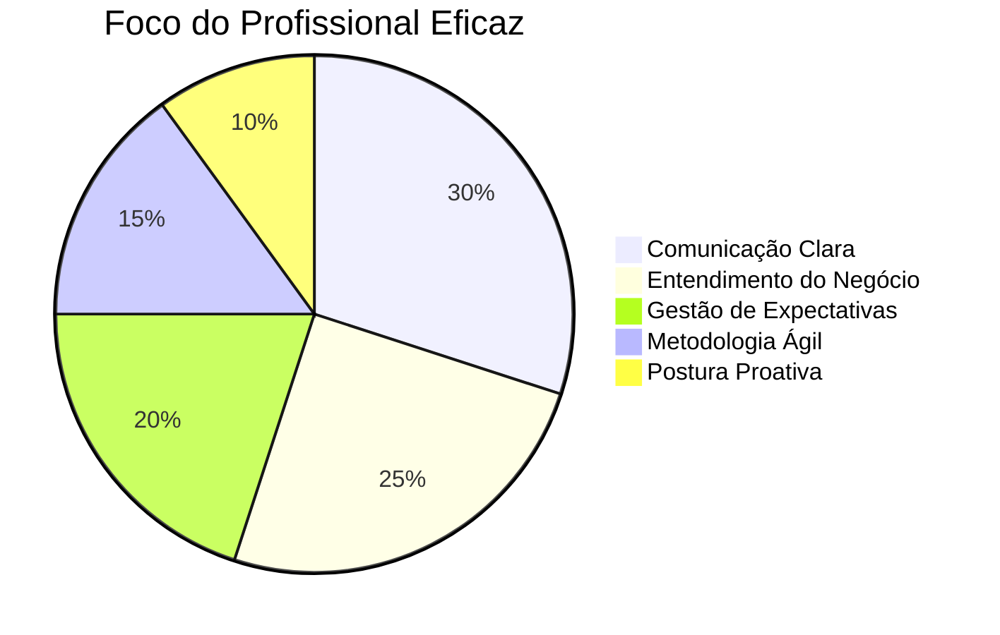

# 📌 **Pontos-Chave para Eficácia em Projetos de TI**  

## 🎯 **Foco em Resultados (Eficácia vs. Eficiência)**  
- **Eficácia**: Entregar o que o cliente realmente precisa (valor).  
- **Eficiência**: Fazer rápido e com menos recursos (otimização).  
- **Priorize**:  
  - 1º Ser **eficaz** (acertar o alvo).  
  - 2º Ser **eficiente** (otimizar processos).  

---

## ✉️ **Comunicação Clara e Objetiva**  
### **Regras de Ouro**:  
1. **Evite jargões técnicos** com clientes não técnicos.  
   - ❌ *"Precisamos refatorar o microsserviço devido a acoplamento alto."*  
   - ✅ *"Vamos ajustar o sistema para evitar travamentos futuros."*  
2. **Use o método "5W2H"** em relatórios:  
   - **What, Why, Who, Where, When, How, How much**.  
3. **Documente decisões** em ata de reunião (1 página no máximo).  

### **Ferramentas Úteis**:  
- **Slack/Teams**: Canais separados por projeto/tópico.  
- **Notion/Confluence**: Centralize documentação.  

---

## 🔄 **Metodologias Ágeis (Dicas Práticas)**  
- **Daily Scrum**:  
  - Fale apenas: **O que fez? O que vai fazer? Bloqueios?** (máx. 15 min).  
- **Sprint Review**:  
  - Mostre **funcionalidades reais** (não só slides).  
- **Retrospectiva**:  
  - Pergunte: **O que melhorar? O que repetir?**  

---

## 🛠 **Gestão de Expectativas**  
- **Sobprometa e Entregue a Mais**:  
  - Ex: Se a tarefa leva 5 dias, informe "7 dias" (evita frustração).  
- **Comunique riscos cedo**:  
  - Alerte o cliente **antes** que o problema aconteça.  

---

## 🧠 **Postura Profissional**  
- **Seja proativo**:  
  - Não espere problemas; antecipe-se (ex: teste antes do prazo).  
- **Domine o negócio do cliente**:  
  - Entenda **como o projeto impacta o lucro dele**.  
- **Feedback construtivo**:  
  - Critique ideias, não pessoas ("O código tem vulnerabilidade" vs. "Você errou").  

---

## ⚠️ **Red Flags (Cuidado!)**  
- **Cliente diz**: "Isso é simples, não deve demorar."  
  - **Solução**: Peça detalhes e documente.  
- **Equipe sobrecarregada**:  
  - **Solução**: Use a matriz **Urgente vs. Importante** para priorizar.  

---

## 📊 **Resumo Visual**  

---

## ✅ **Checklist de Eficácia**  
- [ ] Comunico problemas **antes** que escalem.  
- [ ] Entendo o impacto do meu trabalho no negócio do cliente.  
- [ ] Uso linguagem simples em relatórios.  
- [ ] Documento decisões importantes.  
- [ ] Faço perguntas para esclarecer ambiguidades.  

**Dica final**: Revise este checklist no fim de cada semana! 🚀
